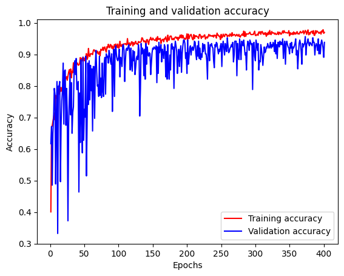
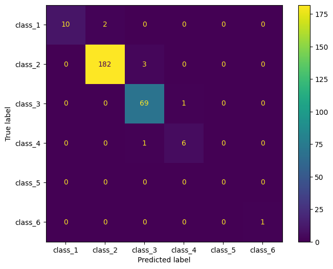
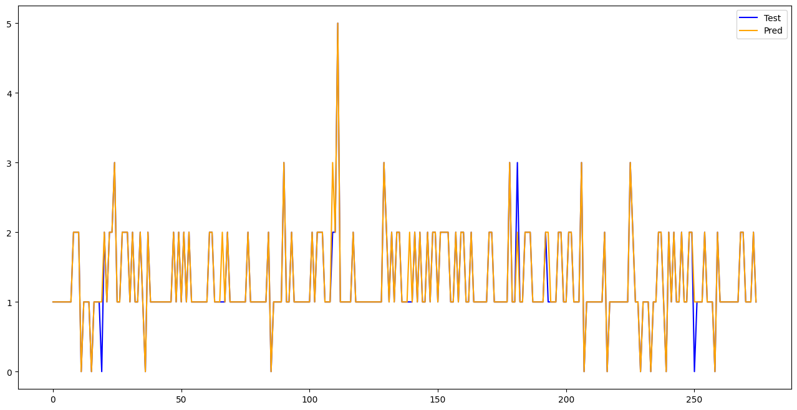

# Tehran Air Quality Classification with an Artificial Neural Network

> **Multi-class Air Quality Index (AQI) classification using a feed-forward Artificial Neural Network (ANN) built with Keras/TensorFlow.**

[](https://www.python.org/)
[](https://www.tensorflow.org/)
[](https://scikit-learn.org/)
[](https://colab.research.google.com/)

## Overview

This project uses an **Artificial Neural Network (ANN)** to classify Tehran air-quality observations into **six AQI-based classes**.

The notebook:

- loads the Tehran air-quality dataset from an Excel file;
- removes the `Time` column;
- converts the numeric `AQI` value into six categorical outcome classes;
- splits the data into training, validation, and test sets;
- one-hot encodes the target labels;
- trains a fully connected neural network with Keras;
- uses **RMSprop**, categorical cross-entropy, early stopping, and model checkpointing;
- evaluates the model using accuracy, balanced accuracy, macro F1, a classification report, and confusion matrices;
- includes a GridSearchCV experiment for ANN hyperparameter tuning.

The project contains **1,827 observations**. The implemented split is approximately **70% training / 15% validation / 15% test**.

---

## AQI Class Mapping

The notebook creates the target variable `Outcomes` from `AQI` using the following thresholds:

| Class | AQI range |
|---:|---:|
| 0 | `< 51` |
| 1 | `51–100` |
| 2 | `101–150` |
| 3 | `151–200` |
| 4 | `201–300` |
| 5 | `> 300` |

> The class labels above follow the exact numeric mapping implemented in the notebook.

---

## Dataset Split

| Split | Samples | Class distribution |
|---|---:|---|
| Training | 1,278 | `{0: 54, 1: 835, 2: 339, 3: 48, 4: 1, 5: 1}` |
| Validation | 274 | `{0: 13, 1: 176, 2: 78, 3: 6, 4: 1}` |
| Test | 275 | `{0: 12, 1: 185, 2: 70, 3: 7, 5: 1}` |
| **Total** | **1,827** | — |

The dataset is notably imbalanced, with the middle AQI classes representing most observations.

---

## Model Architecture

The final model defined in the notebook is a compact feed-forward ANN:

```text
Input
  │
  ▼
Dense(21) + ReLU
  │
  ▼
Dense(48) + ReLU
  │
  ▼
Dense(6) + Softmax
  │
  ▼
Six AQI classes
```

### Model configuration

| Component | Configuration |
|---|---|
| Input | 14 features |
| Hidden layer 1 | 21 neurons, ReLU |
| Hidden layer 2 | 48 neurons, ReLU |
| Output layer | 6 neurons, Softmax |
| Optimizer | RMSprop |
| Loss | Categorical Cross-Entropy |
| Metric | Accuracy |
| Total parameters | 1,665 |
| Training batch size | 31 |
| Maximum epochs | 5,000 |
| Early stopping | `val_loss`, patience = 200 |
| Checkpointing | Best validation loss |

The 14-feature input size is consistent with the trained model summary reported in the notebook.

---

## Training

Training and validation accuracy are tracked throughout the fitting process.

<p align="center">
  
</p>

The training curve shows accuracy improving rapidly during the early epochs and then stabilizing at a high level. Validation accuracy remains generally strong, although it is more variable than training accuracy.

---

## Hyperparameter Search

The notebook also performs a GridSearchCV experiment over ANN architecture and training parameters.

The reported best configuration from that experiment was:

```text
batch_size = 30
epochs = 100
neurons_1 = 20
neurons_2 = 50
optimizer = rmsprop
```

The final manually defined model uses a slightly different architecture (`21 → 48 → 6`) and a longer training budget with early stopping.

> Hyperparameter-search code requires **SciKeras**. One later notebook cell also records an environment error when `scikeras` was not installed.

---

## Results

On the held-out test set (**275 samples**), the notebook reports:

| Metric | Score |
|---|---:|
| **Accuracy** | **97.45%** |
| **Balanced Accuracy** | **93.20%** |
| **Macro F1** | **94.35%** |
| Weighted F1 | 97% |

### Per-class performance

| Class | Precision | Recall | F1-score | Support |
|---:|---:|---:|---:|---:|
| 0 | 1.00 | 0.83 | 0.91 | 12 |
| 1 | 0.99 | 0.98 | 0.99 | 185 |
| 2 | 0.95 | 0.99 | 0.97 | 70 |
| 3 | 0.86 | 0.86 | 0.86 | 7 |
| 5 | 1.00 | 1.00 | 1.00 | 1 |

The notebook's test confusion matrix contains **8 misclassified observations out of 275**, corresponding to the reported 97.45% accuracy.

---

## Confusion Matrix

<p align="center">
  
</p>

The largest test class is class `1`, with **182 correctly classified observations out of 185**. Most of the remaining errors are concentrated around neighboring AQI classes.

---

## Test vs. Predicted Classes

<p align="center">
  
</p>

This visualization compares the true test labels with the ANN's predicted class for each test observation.

---

## Tech Stack

- **Python**
- **Pandas** — data loading and manipulation
- **NumPy** — numerical operations
- **TensorFlow / Keras** — ANN construction and training
- **Scikit-learn** — train/test splitting, metrics, confusion matrices, and GridSearchCV
- **SciKeras** — Keras + scikit-learn integration for hyperparameter search
- **Matplotlib / Seaborn** — visualization
- **Google Colab / Google Drive** — notebook execution and dataset access

---

## Installation

Install the main dependencies with:

```bash
pip install -r requirements.txt
```

Or install them directly:

```bash
pip install pandas numpy scikit-learn tensorflow matplotlib seaborn scikeras openpyxl
```

---

## Running the Project

### 1. Prepare the dataset

The notebook expects an Excel file named:

```text
OrginalAQTehran.xlsx
```

and, in the current notebook version, loads it from Google Drive:

```python
data = pd.read_excel('/content/drive/My Drive/OrginalAQTehran.xlsx')
```

### 2. Open the notebook

Run:

```text
AQT_ANN.ipynb
```

in Google Colab or a compatible Jupyter environment.

### 3. Execute the workflow

The main workflow is:

```text
Excel dataset
     │
     ▼
Data cleaning
     │
     ▼
AQI → six outcome classes
     │
     ▼
Train / Validation / Test split
     │
     ▼
One-hot encoding
     │
     ▼
ANN training
     │
     ├── Early stopping
     └── Best-model checkpoint
     │
     ▼
Test prediction
     │
     ▼
Accuracy / Balanced Accuracy / F1
     │
     ▼
Confusion matrix & visualizations
```

---

## Repository Structure

```text
.
├── AQT_ANN.ipynb
├── README.md
├── requirements.txt
└── assets/
    ├── training_validation_accuracy.png
    ├── confusion_matrix.png
    └── test_vs_predicted.png
```

The dataset itself is not included in this package because the notebook currently reads it from Google Drive.

---

## Notes

- The target is derived directly from the notebook's `AQI` threshold function.
- The data distribution is highly imbalanced, so **balanced accuracy** and **macro F1** are useful complements to ordinary accuracy.
- The notebook saves the best Keras model as `best_model.keras` when the checkpoint cell is executed.
- Hyperparameter tuning can take substantial time; the notebook reports approximately **98 minutes** for one GridSearchCV experiment.
- Reproducing the exact results may depend on the TensorFlow/Keras, SciKeras, scikit-learn, and runtime versions.

---

## Author

**AQT ANN — Tehran Air Quality Classification**

If you use or extend this project, consider documenting the dataset source, feature definitions, and experimental setup alongside the notebook for easier reproducibility.
